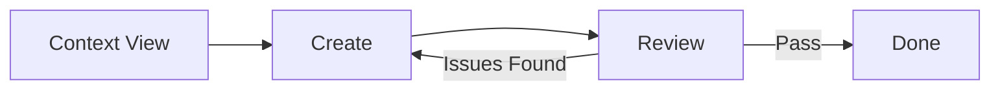

# Figma MCP Review Workflow

Verify design compliance by comparing created designs against the original extracted context, detecting deviations, and generating a compliance report.

## Prerequisites

- Completed `/figma-mcp-context-view` workflow (context files exist)
- Completed `/figma-mcp-create` workflow (designs created)
- Figma plugin connected (verify with `get_figma_state`)
- Context files at `.figma/context/{document-name}.json`

---

## Step 1: Verify Connection

```
1. Call `mcp_figma-bridge_get_figma_state`
2. Confirm connected: true and ready: true
3. If not connected, ask user to run the Figma plugin
```

---

## Step 2: Load Original Context

```
1. Read `.figma/context/{document-name}.json` for original design tokens
2. Read `.figma/context/{document-name}.md` for quick reference
3. Store expected values for comparison:
   - Paint style IDs and their hex values
   - Text style IDs and font properties
   - Spacing scale values
   - Corner radius patterns
   - Component keys used
```

### Context Data to Cache

| Data | Purpose |
|------|---------|
| Paint Styles | Compare fill/stroke bindings |
| Text Styles | Verify typography consistency |
| Spacing Scale | Check padding/gap compliance |
| Corner Radius | Validate border radius usage |
| Components | Verify correct component usage |
| Page Structure | Compare layout patterns |

---

## Step 3: Scan Created Design

```
1. Call `mcp_figma-bridge_get_document_manifest` to get page list
2. Identify newly created pages/frames by name or timestamp
3. For each created frame:
   - Call `mcp_figma-bridge_deep_scan_page` with pageId
   - Store complete node tree with all properties
```

### Node Properties to Extract

| Property | What to Check |
|----------|---------------|
| `fillStyleId` | Is it bound to a style or hardcoded? |
| `textStyleId` | Text style binding present? |
| `effectStyleId` | Shadow/blur from style? |
| `fills` | Raw color values if no style |
| `fontName` | Font family and weight |
| `fontSize` | Typography size |
| `itemSpacing` | Auto-layout gaps |
| `padding*` | Padding values |
| `cornerRadius` | Border radius values |

---

## Step 4: Compare Against Context

### 4.1 Style Binding Compliance

```javascript
// Check if nodes use style IDs instead of hardcoded values
const violations = [];

for (const node of scannedNodes) {
  // Check fills
  if (node.fills && node.fills.length > 0 && !node.fillStyleId) {
    violations.push({
      nodeId: node.id,
      nodeName: node.name,
      type: 'HARDCODED_FILL',
      severity: 'WARNING',
      actual: node.fills[0].color,
      expected: 'Should use fillStyleId from design context'
    });
  }
  
  // Check text
  if (node.type === 'TEXT' && !node.textStyleId) {
    violations.push({
      nodeId: node.id,
      nodeName: node.name,
      type: 'HARDCODED_TEXT_STYLE',
      severity: 'WARNING',
      actual: { fontSize: node.fontSize, fontName: node.fontName },
      expected: 'Should use textStyleId from design context'
    });
  }
  
  // Check effects
  if (node.effects && node.effects.length > 0 && !node.effectStyleId) {
    violations.push({
      nodeId: node.id,
      nodeName: node.name,
      type: 'HARDCODED_EFFECT',
      severity: 'WARNING',
      actual: node.effects,
      expected: 'Should use effectStyleId from design context'
    });
  }
}
```

### 4.2 Spacing Compliance

```javascript
// Verify spacing follows the design scale
const spacingScale = context.patterns.spacing.scale; // e.g., [4, 8, 16, 24, 32, 48]

for (const node of nodesWithAutoLayout) {
  if (!spacingScale.includes(node.itemSpacing)) {
    violations.push({
      nodeId: node.id,
      nodeName: node.name,
      type: 'OFF_SCALE_SPACING',
      severity: 'INFO',
      actual: node.itemSpacing,
      expected: `One of: ${spacingScale.join(', ')}`
    });
  }
}
```

### 4.3 Corner Radius Compliance

```javascript
const radiusScale = context.patterns.cornerRadius; // e.g., [0, 4, 8, 12, 16, 9999]

for (const node of nodesWithRadius) {
  if (!radiusScale.includes(node.cornerRadius)) {
    violations.push({
      nodeId: node.id,
      nodeName: node.name,
      type: 'OFF_SCALE_RADIUS',
      severity: 'INFO',
      actual: node.cornerRadius,
      expected: `One of: ${radiusScale.join(', ')}`
    });
  }
}
```

### 4.4 Component Usage

```javascript
// Check if library components were used correctly
for (const instance of componentInstances) {
  const expectedComponent = context.components.library.find(
    c => c.key === instance.componentKey
  );
  
  if (!expectedComponent) {
    violations.push({
      nodeId: instance.id,
      nodeName: instance.name,
      type: 'UNKNOWN_COMPONENT',
      severity: 'WARNING',
      actual: instance.componentKey,
      expected: 'Component from design context'
    });
  }
}
```

---

## Step 5: Visual Comparison with Screenshots

### 5.1 Export Created Design Screenshots

```
1. For each created frame:
   - Call `mcp_figma-bridge_export_node_image` with nodeId
   - Parameters: format: "png", scale: 2
   - Save to `.figma/screenshots/created/{frame-name}.png`
```

### 5.2 Load Reference Screenshots

```
1. Read reference images from `.figma/screenshots/references/` (saved during context workflow)
2. Match screenshots by:
   - Similar frame names
   - Similar dimensions
   - Page structure patterns
```

### 5.3 Visual Diff Analysis

Compare created screenshots against reference screens to identify:

| Check | Description |
|-------|-------------|
| Layout Consistency | Similar section arrangement |
| Color Palette | Matching brand colors |
| Typography Hierarchy | Heading sizes and weights |
| Spacing Rhythm | Consistent vertical rhythm |
| Component Patterns | Similar button, card, nav styles |
| Alignment | Grid and alignment consistency |

```
Report visual observations:
- "Header layout matches reference at 64px height"
- "Card spacing differs: 16px vs expected 24px"
- "Button style consistent with Primary variant"
```

---

## Step 6: Qualitative Design Audit

> 🧠 **AI Analysis Required**: This step requires visual reasoning and heuristic evaluation, not just code checks.

### 6.1 Usability Heuristics (Nielsen)

Evaluate key screens against these core heuristics:

| Heuristic | Check |
|-----------|-------|
| **Visibility of Status** | Are loading states, active tabs, and breadcrumbs visible? |
| **Match Real World** | Do icons and terms match user mental models? |
| **User Control** | Are there "Back" buttons and "Cancel" options? |
| **Error Prevention** | Are destructive actions confirmed? Are constraints clear? |
| **Recognition vs Recall** | Is navigation visible? Are icons labeled? |

### 6.2 Accessibility Check (Visual)

| Category | Check |
|----------|-------|
| **Contrast** | Do text/bg combinations meet WCAG AA (4.5:1)? |
| **Touch Targets** | Are buttons at least 44x44px? |
| **Hierarchy** | Is the heading structure logical (H1 -> H2)? |
| **Feedback** | Do errors use more than just color (icons, text)? |

### 6.3 Aesthetic Quality

| Check | Standard |
|-------|----------|
| **Visual Hierarchy** | Is the primary action the most prominent element? |
| **Whitespace** | Is spacing balanced and consistent? |
| **Complexity** | Is the interface free of unnecessary clutter? |

---

## Step 7: Generate Compliance Report

Create `.figma/reviews/{timestamp}-review.md`:

```markdown
# Design Compliance Report

**Generated**: {ISO timestamp}
**Document**: {document name}
**Reviewed Frames**: {count}

## Summary

| Category | Pass | Warn | Fail |
|----------|------|------|------|
| Style Bindings | X | Y | Z |
| Spacing | X | Y | Z |
| Typography | X | Y | Z |
| Components | X | Y | Z |
| Qualitative | - | - | Pass/Fail |

## Compliance Score: XX%

---

## Detailed Findings

### 🔴 Critical Issues (Requires Fix)
{List of FAIL severity items}

### 🟡 Warnings (Recommended Fix)
{List of WARNING severity items}

### 🔵 Suggestions (Optional)
{List of INFO severity items}

---

## Style Binding Analysis

### Hardcoded Values Found
| Node | Property | Value | Suggested Style |
|------|----------|-------|-----------------|
| ... | ... | ... | ... |

---

## Spacing Analysis

### Off-Scale Values
| Node | Property | Value | Nearest Scale Value |
|------|----------|-------|---------------------|
| ... | ... | ... | ... |

---

## Visual Comparison

### Reference vs Created
{Embedded screenshots side-by-side}

### Observations
- {List of visual differences or matches}

---

## Recommendations

1. {Specific fix recommendation}
2. {Style binding suggestion}
3. {Pattern adherence tip}
```

---

## Step 8: Store Review Results

```
1. Save JSON results to `.figma/reviews/{timestamp}-review.json`
2. Update `.figma/reviews/latest.json` symlink/copy
3. Log review in `.figma/reviews/history.md`
```

### Review JSON Structure

```json
{
  "reviewedAt": "ISO timestamp",
  "document": "Document Name",
  "frames": ["Frame ID 1", "Frame ID 2"],
  "complianceScore": 85,
  "summary": {
    "pass": 45,
    "warn": 8,
    "fail": 2
  },
  "violations": [
    {
      "nodeId": "xxx",
      "nodeName": "Card Title",
      "type": "HARDCODED_FILL",
      "severity": "WARNING",
      "actual": "#0066FF",
      "expected": "Primary/500 (S:abc123)"
    }
  ],
  "screenshots": {
    "created": [".figma/screenshots/created/hero.png"],
    "references": [".figma/screenshots/references/homepage-hero.png"]
  }
}
```

---

## Severity Levels

| Level | Description | Action |
|-------|-------------|--------|
| **FAIL** | Critical deviation from design system | Must fix before ship |
| **WARNING** | Hardcoded value or missing binding | Should fix |
| **INFO** | Minor inconsistency or suggestion | Optional |

---

## Violation Types

| Type | Description | Severity |
|------|-------------|----------|
| `HARDCODED_FILL` | Fill color not using style | WARNING |
| `HARDCODED_TEXT_STYLE` | Text not using text style | WARNING |
| `HARDCODED_EFFECT` | Effect not using effect style | WARNING |
| `HARDCODED_VARIABLE` | Value not bound to variable | INFO |
| `OFF_SCALE_SPACING` | Spacing value not in scale | INFO |
| `OFF_SCALE_RADIUS` | Radius not in scale | INFO |
| `UNKNOWN_COMPONENT` | Component not from design system | WARNING |
| `MISSING_FONT_LOAD` | Font used without loading | FAIL |
| `WRONG_LAYOUT_MODE` | Auto-layout not matching pattern | INFO |
| `ACCESSIBILITY_CONTRAST` | Low contrast text | WARNING |

---

## Usage

```
/figma-mcp-review
```

## Workflow Integration



---

## Auto-Fix Suggestions

When violations are found, generate fix commands:

```javascript
// Example auto-fix for hardcoded fill
const suggestedFix = `
// Fix for node "${violation.nodeName}"
const node = figma.getNodeById("${violation.nodeId}");
const style = figma.getLocalPaintStyles().find(s => s.id === "${suggestedStyleId}");
if (node && style) node.fillStyleId = style.id;
`;
```

---

## Output Files

| File | Purpose |
|------|---------|
| `.figma/reviews/{timestamp}-review.md` | Human-readable report |
| `.figma/reviews/{timestamp}-review.json` | Structured data |
| `.figma/reviews/latest.json` | Latest review data |
| `.figma/screenshots/created/` | Screenshots of reviewed frames |

---

*Workflow v1.0 - Ensures design consistency and compliance with extracted patterns.*
