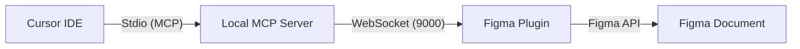

# Figma IDE Bridge

Connect your Cursor IDE (or any MCP-enabled environment) directly to a running Figma instance. This bridge bypasses standard read-only MCP limitations by executing raw JavaScript code directly within the Figma sandbox via the Figma Plugin API.

## 🏗️ Architecture

This is a monorepo consisting of two main components:

-   **`plugin/`**: A TypeScript/React Figma plugin. It acts as the execution engine inside Figma, connecting to the local server via WebSockets.
-   **`server/`**: A Node.js/TypeScript Local MCP Server. It communicates with the IDE via Stdio and relays commands to the Figma plugin.



## ✨ Features

-   **Live Execution**: Execute any Figma Plugin API code from your IDE.
-   **Smart Scanning**: Lightweight document manifest for quick overview + deep page scanning for detailed analysis.
-   **Design System Awareness**: Tools to retrieve styles, variables, and components to ensure consistency.
-   **Mode-Aware UI**: Switch between Editing, Creating, Context, and Misc modes directly from the plugin UI.
-   **Floating Activity Log**: Monitor communication between the IDE and Figma in real-time.

## 🚀 Getting Started

### 1. Setup the Local Server
Navigate to the `server` directory and install dependencies:
```bash
cd server
npm install
npm run build
npm start
```
The server will start listening on WebSocket port `9000` and Stdio.

### 2. Setup the Figma Plugin
Navigate to the `plugin` directory:
```bash
cd plugin
npm install
npm run build
```
1.  Open Figma.
2.  Go to **Plugins** -> **Development** -> **Import plugin from manifest...**.
3.  Select `plugin/manifest.json`.
4.  Run the plugin. It should show a "Connected" status if the server is running.

### 3. Connect Cursor/IDE
Add the MCP server to your IDE configuration:
-   **Command**: `node [absolute-path-to-repo]/server/dist/index.js`
-   **Type**: `stdio`

## 🛠️ Development

### Plugin
-   `src/controller.ts`: Handles the main Figma thread (API calls).
-   `src/ui.tsx`: The React-based user interface.
-   Run `npm run watch` to rebuild automatically on changes.

### Server
-   `src/index.ts`: The MCP server implementation and WebSocket relay.
-   Run `npm run dev` for automatic TypeScript compilation.

## 📄 License
MIT
