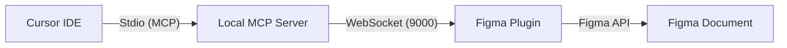

# Figma IDE Bridge

Connect your Cursor IDE (or any MCP-enabled environment) directly to a running Figma instance. This bridge bypasses standard read-only MCP limitations by executing raw JavaScript code directly within the Figma sandbox via the Figma Plugin API.

## 🏗️ Architecture

This is a monorepo consisting of two main components:

-   **`plugin/`**: A TypeScript/React Figma plugin. It acts as the execution engine inside Figma, connecting to the local server via WebSockets.
-   **`server/`**: A Node.js/TypeScript Local MCP Server. It communicates with the IDE via Stdio and relays commands to the Figma plugin.



## ✨ Features

-   **Live Execution**: Execute any Figma Plugin API code from your IDE.
-   **Smart Scanning**: Lightweight document manifest for quick overview + deep page scanning for detailed analysis.
-   **Design System Awareness**: Tools to retrieve styles, variables, and components to ensure consistency.
-   **Mode-Aware UI**: Switch between Editing, Creating, Context, and Misc modes directly from the plugin UI.
-   **Floating Activity Log**: Monitor communication between the IDE and Figma in real-time.

## 🚀 Getting Started

### 1. Setup the Local Server
Navigate to the `server` directory and install dependencies:
```bash
cd server
npm install
npm run build
npm start
```
The server will start listening on WebSocket port `9000` and Stdio.

### 2. Setup the Figma Plugin
Navigate to the `plugin` directory:
```bash
cd plugin
npm install
npm run build
```
1.  Open Figma.
2.  Go to **Plugins** -> **Development** -> **Import plugin from manifest...**.
3.  Select `plugin/manifest.json`.
4.  Run the plugin. It should show a "Connected" status if the server is running.

### 3. MCP Configuration

Add the Figma Bridge MCP server to your IDE's MCP configuration file.

#### Cursor / VS Code

Add the following to your MCP settings (`.cursor/mcp.json` or equivalent):

```json
{
  "mcpServers": {
    "figma-bridge": {
      "command": "npx",
      "args": [
        "tsx",
        "c:/Users/Admin/Documents/GitHub/Figma Write MCP/server/src/index.ts"
      ]
    }
  }
}
```

#### Claude Desktop

Add to your `claude_desktop_config.json`:

```json
{
  "mcpServers": {
    "figma-bridge": {
      "command": "npx",
      "args": [
        "tsx",
        "c:/Users/Admin/Documents/GitHub/Figma Write MCP/server/src/index.ts"
      ]    
    }
  }
}
```

> **Note**: Replace `C:/path/to/Figma Write MCP` with the actual absolute path to your cloned repository.

## 🛠️ Tools Reference

The bridge exposes a full suite of tools for design creation, analysis, and presentation management.

### 🔍 Discovery & Context
- **`get_figma_state`**: Verifies plugin connectivity and readiness.
- **`get_document_manifest`**: Provides a lightweight tree of pages and top-level frames.
- **`get_design_context`**: **(Recommended First Call)** Retrieves all local/library styles, variables, components, and current selection details.
- **`get_selection_context`**: Detailed properties (colors, layout, variables) of currently selected nodes.
- **`deep_scan_page`**: Exhaustive node-by-node analysis of a specific page.

### 🎨 Design & Manipulation
- **`execute_figma_command`**: Runs raw JavaScript in the Figma sandbox. Supports `async/await`.
- **`clone_node`**: Duplicates existing frames or components while preserving structures.
- **`analyze_patterns`**: Identifies design system usage (spacing, colors, corner radii) to ensure visual consistency.
- **`export_node_image`**: Captures high-res screenshots for visual verification.

### 📊 Presentation Management
- **`scan_presentation`**: Auto-classifies slides and identifies editable text/image slots.
- **`configure_presentation`**: Marks special slides (Cover, ToC, Separators) for intelligent filling.
- **`fill_slide`**: Populates identified slots with targeted content.
- **`get_presentation_cache`**: Instant access to previous scan results.

## 📝 Best Practices for AI Agents

1.  **Always use `get_design_context` first**: Never guess style IDs or component keys.
2.  **No Hardcoding**: Use `node.fillStyleId` or `node.strokeStyleId` with IDs obtained from the context.
3.  **Font Loading**: Always `await figma.loadFontAsync({ family: "Font", style: "Style" })` before editing text.
4.  **Auto-Layout**: Set `layoutMode` before adding children, and `layoutSizingHorizontal/Vertical` after appending.
5.  **Sequential Creation**: Create the container node first, set its properties, then append children.

## 🛠️ Development

### Plugin
-   `src/controller.ts`: Handles the main Figma thread (API calls).
-   `src/ui.tsx`: The React-based user interface.
-   Run `npm run watch` to rebuild automatically on changes.

### Server
-   `src/index.ts`: The MCP server implementation and WebSocket relay.
-   Run `npm run dev` for automatic TypeScript compilation.

## 📄 License
MIT
